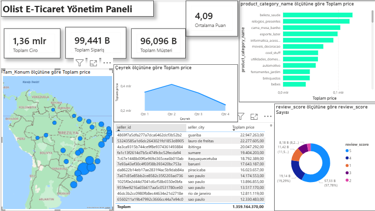

# 🛒 Olist E-Ticaret Veri Analizi & Yapay Zeka Projesi

Bu proje, Brezilya'nın en büyük pazaryeri olan Olist verileri kullanılarak; SQL ile veri madenciliği, Python ile Müşteri Segmentasyonu (AI) ve Power BI ile interaktif raporlama süreçlerini kapsar.

## 📊 Dashboard Önizleme

## 🛠️ Kullanılan Teknolojiler
* **SQL Server:** Veri depolama ve karmaşık analiz sorguları.
* **Python (Scikit-Learn):** K-Means algoritması ile makine öğrenmesi tabanlı müşteri segmentasyonu.
* **Power BI:** Şirket içi yönetici takip paneli.

## 📂 Proje İçeriği
- `app.py`: Müşteri davranışlarını analiz eden yapay zeka kodu.
- `queries/`: Satış trendleri ve satıcı performansını ölçen SQL dosyaları.
- `requirements.txt`: Proje için gerekli kütüphaneler (Pandas, Scikit-learn vb.).

---
